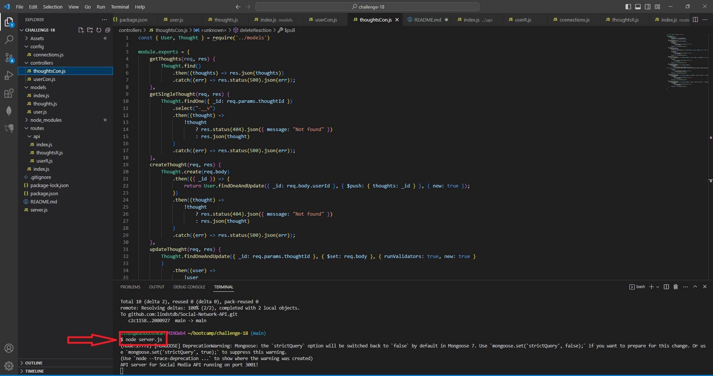
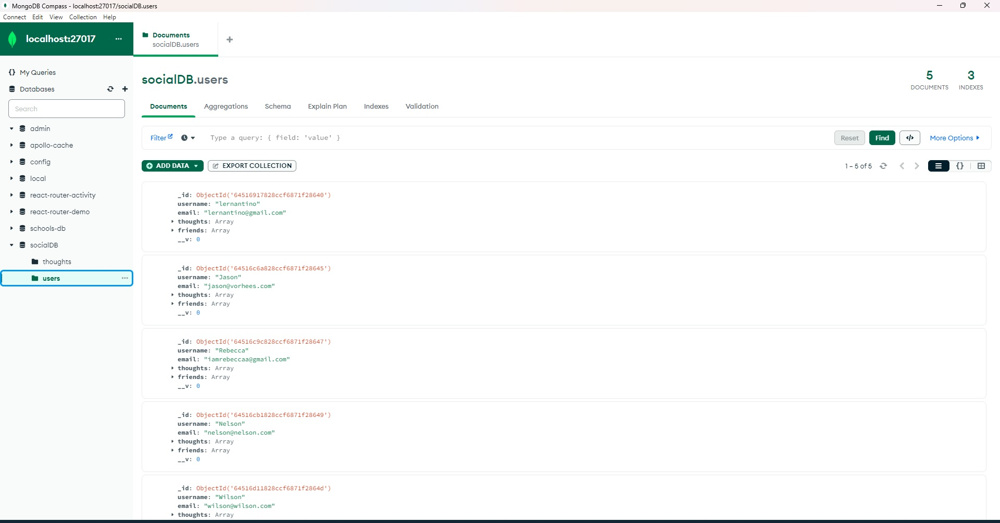
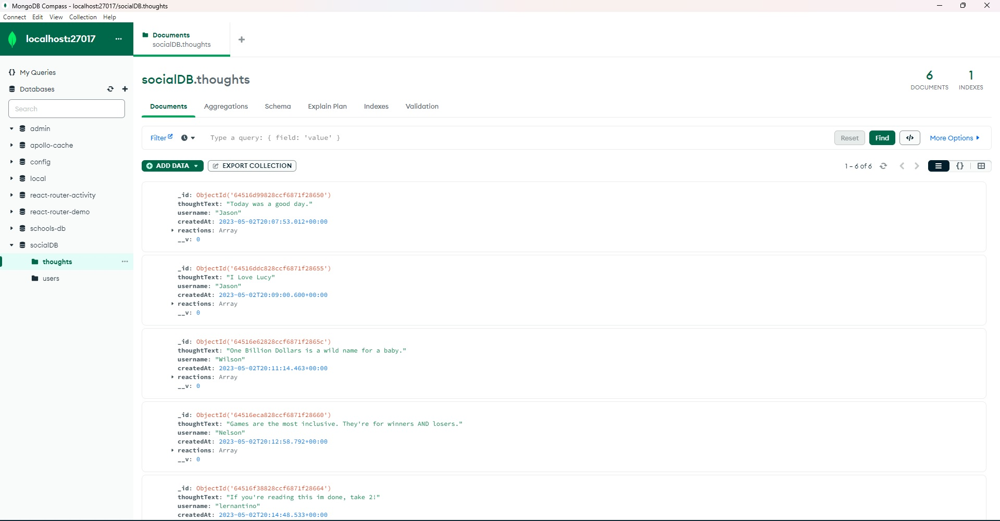
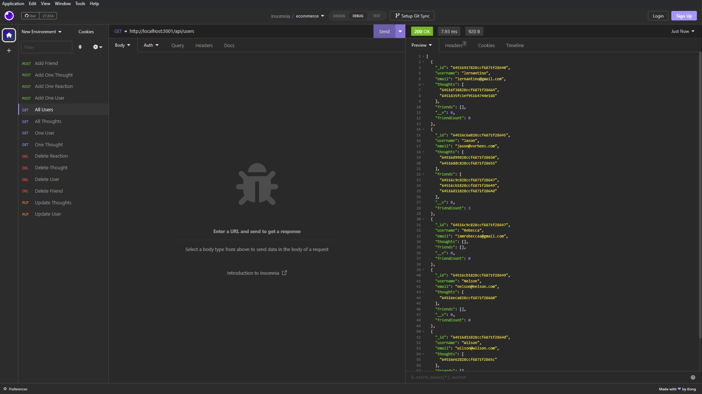
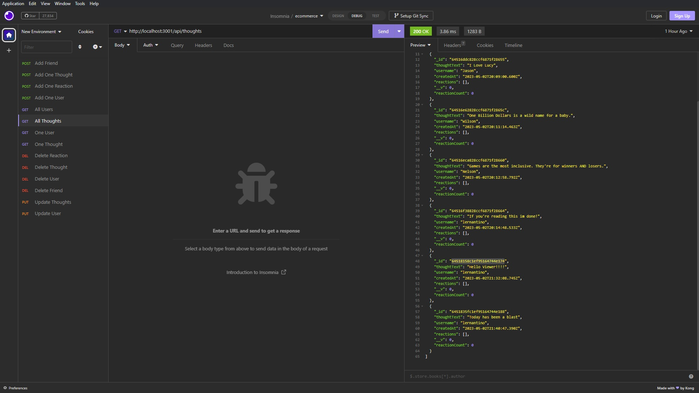

# Social Network API

## Description

Provide a short description explaining the what, why, and how of your project. Use the following questions as a guide:

- My motivation to build this backend project was to organize and easily update user information.
- This project was built to serve as the backend for a social media company to add on to or learn from.
- This build solves the problem of not easily being able to update, add, and delete users, friends, thoughts, and reactions.
- This project taught me about mongo db, the real magic of insomnia, and sharpened the node skills.

## Table of Contents (Optional)

If your README is long, add a table of contents to make it easy for users to find what they need.

- [Installation](#installation)
- [Screenshots](#screenshots)
- [Technologies Used](#technologies-used)
- [License](#license)

## Installation

'npm i' 'node server.js'

## Usage

Video Walk-Through: https://drive.google.com/file/d/1P8K5y0ZnvEZZ27Ha1s6B-l8nM1S5TPe6/view 

## Technologies Used

- javascript
- node.js
- express.js
- insomnia
- mongoose

